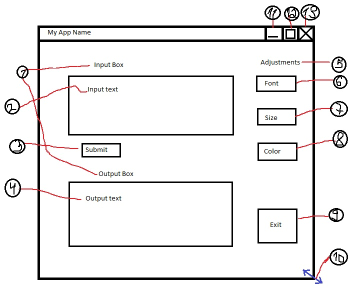
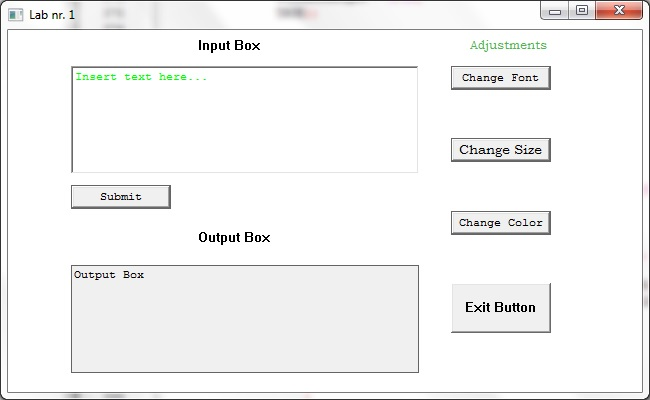

Title
=========

Window. Window handling. Basic window’s form elements
------------------------------------------------------

#### Purpose: ####

* Event driven programming (message-oriented)
* Windows API. 
* Windows application development

#### Additional purpose: 

* Version Control Systems (GIT)
* Programming Style Guidelines

## Completed Mandatory Objectives:

* Create a Windows application
* Choose Programming Style Guidelines that you'll follow
* Add 2 buttons to window: one with default styles, one with custom styles (size, background, text color, font family, font size)
* Add 2 text inputs to window: one with default styles, one with custom styles (size, background, text color, font family, font size)
* Add 2 text elements to window: one with default styles, one with custom styles (size, background, text color, font family, font size)

## Completed Objectives with additional points:

* Make elements to fit window on resize **(1 pt)**
* Make elements to interact or change other elements (1 pt for 2 different interactions) **(0-2 pt)**
* Change behavior of different window actions (at least 3). **(1 pt)**

## The application creation stepts

For creating this app I've read the chapters that where specified in the task of the lab and also the [www.MSDN.com](http://msdn.microsoft.com/en-US/) website for and advance look and [StackOverflow.com](http://stackoverflow.com/). 

For developing the project, I've used the CodeBlocks IDE. The project can be simply compiled having the ** *.cbp ** file and the resource ** *.cpp **. You should have them both in the same directory. Open the file ** *.cbp ** and compile the project. 

The mockup of the app:

1. Two simple text fields with default styles
2. The Input Edit Box
3. The Submit Button. When clicked, a Message Box with the text from the Input box appears. If clicked Yes, it will display the above text in Output Box
4. Output Edit Box
5. Styled text field (font, color, size)
6. Font Button - changes the font of the text in Input and Output Boxes
7. Size Button - changes the size of the text in Input and Output Boxes
8. Color Button - changes the color of the text only of the text from the Input Box 
9. Exit Button - quits the program and distroyes the window
10. When resized, the buttons' and the Edit Boxes' position changes according to the size of the Window
11. If you click Minimize - there will appear a Message Box, but the Window will stay unchanged
12. If you click Maximize - the position of the Window will change randomly and a Message Box will appear 
13. If you click Close - a Message Box will appear, but the Window will stay unchanged

#### Features: ####

*	3 Text fields: 2 text field with default styles, 1 with custom style (font, text color, size)

*	4 Buttons: 1 with default styles, 3 with custom styles (font, text color, text size)

*	By clicking the “Submit” Button the text from “Input Text Box” goes to “Output Text Box”

*	By clicking the “Change Font” Button, the text in “Output Box” updates and changes circularly to one of the four predefined fonts: Tahoma, Courier New, Comic Sans, Bookman Old Style

*	By clicking the “Change Size” Button, the text in “Output Box” updates and changes circularly in size

*	By clicking “Exit” Button the program will terminate execution and the window will be destroyed

*	The window can be resized but it has a minimal dimension

*	The position of the buttons react to the size changes of the window

*	The position and dimensions of the Edit Boxes react to the size changes of the window

*	When clicking on “Close” the window will not be destroyed but a message box will appear above

*	When clicking on “Maximize”, the window will not be maximized but a message box will appear and the position of the window will change randomly

*	When clicking on “Minimize”, the window will not be minimized, but a message box will appear

*	The window can be maximized by typing in input box only the word: “MOVE”
