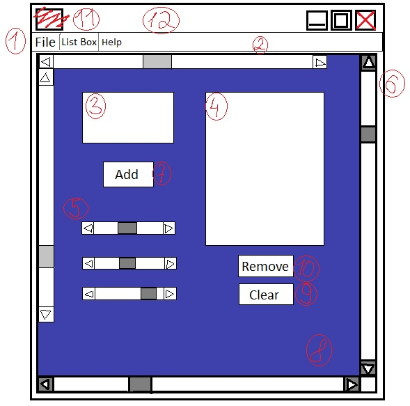
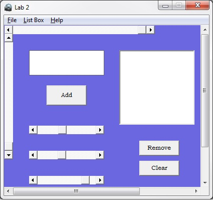
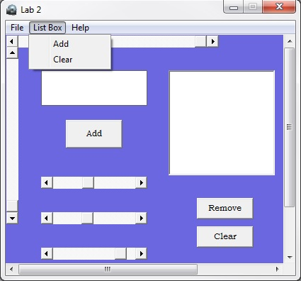
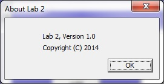

#Windows Programming Laboratory Work #2

Title
=========

Advanced Form Elements. Child Windowses. Basics of Working With Keyboard.

#### Contents: ####

* The Keyboard
* Child Window Controls
	- Scroll Bar
	- Listbox
* Menus and Other Resources
* Dialog Boxes

## Completed Mandatory Objectives

* Display a dialog box on some event (ex. on clicking some button)
* Add a system menu to your application with at least 3 items (add actions to that items)
* Add a scroll bar that will change any visible parameter of any other element (color of a text)
* Hook keyboard input. Add 2 custom events for 2 different keyboard combinations (ex. change window background on ctrl+space)

## Objectives With Points

* Add a listbox and attach some events when any element is accessed (clicked) **(2 pt)**
* Add 2 scroll bars that will manage main window size or position **(1 pt)**
* Customize your application by adding an icon and using different cursor in application **(1 pt)**
* Use a scroll bar to scroll through application working space. Scroll should appear only when necessary (eg. when window width is smaller than 300px) **(1 pt)**

## The application creation stepts

For creating this app I've read the chapters that where specified in the task of the lab and also the [www.MSDN.com](http://msdn.microsoft.com/en-US/) website for and advance look and [StackOverflow.com](http://stackoverflow.com/). 

For developing the project, I've used the Visual Studio IDE. 

####The mockup of the app:

1. A Menu for our application.
2. A scroll bar for changing the width of the window (horizontal scrool bar) and another one for changing the height of the window (vertical scroll bar).
3. Edit box for the text input.
4. A list box.
5. 3 Scroll bars for changing the background color of the window.
6. A window scroll bar for navigating when the window is smaller than a specific area. 
7. A button for transfering the text from input box to the list box.
8. A hotkey for moving the window in a random place on the creen (Ctrl + M).
9. A Clear button for erasing all the content of the list box.
10. A Remove button for removing a selected string from the list box (Also you can remove the item by double-clicking on the desired item).
11. An icon for our aplication.
12. A cursor for our application.
13. A message box appears when the About item from the Help is clicked.

##Conclusion:

The second laboratory was an interesting one and more complicated then the privious one. 

The less obvious and clear at the first look could be the Scroll Bars. It was quiet tricky to play with the [SCROLLINFO](http://msdn.microsoft.com/en-us/library/windows/desktop/bb787537(v=vs.85).aspx) while adjusting the parameters of each scroll. You just cannot use the nMin or nMax field of the SCROLLINFO structure if you didn't set the SIF_RANGE in the nMask field. This was a non obvious thing which consumed me some minutes. 

Another interesting experience was to figure out the manner in which Windows sends messages about the scroll bars adn to differenciate the massage for the window scroll bar and the other one defined as an independent scroll bar. So I had to check if the lParam of the ("WinProc()") function was different from 0. If it was different from 0, then it was necessary to retrieve the indentifier of the scroll bar which send the message using "GetDlgCtrlID((HWND)lParam);", after which it was already easy to process the messages.

The last problem was with the scroll bars which changed the size of the window, because if the range was not set properly, it might end up with the fact that the client area was too small for displaing the clid windows. So the solution was to change the range of the scroll and to start them by 150 (for example).

